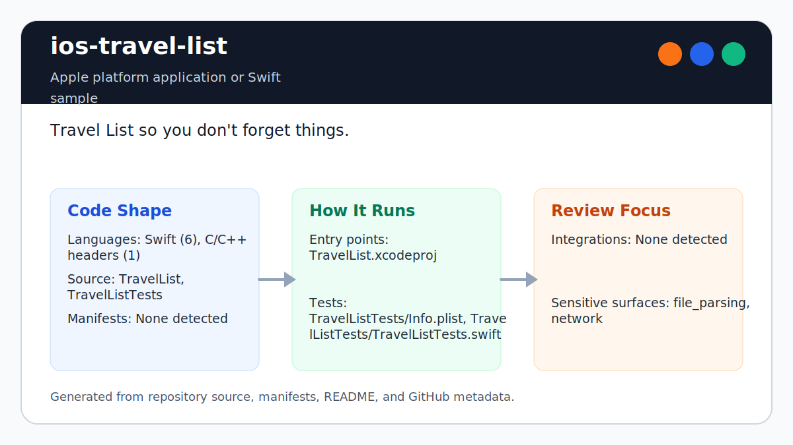

# ios-travel-list

<!-- README-OVERVIEW-IMAGE -->


## Overview

`garethpaul/ios-travel-list` is an Apple platform application or Swift sample. Travel List so you don't forget things.

This README is based on the checked-in source, manifests, scripts, and repository metadata on the `master` branch. The project language mix found during review was: Swift (6), C/C++ headers (1).

## Repository Contents

- `CHANGES.md` - concise history of maintenance changes
- `Makefile` - local verification entry point
- `README.md` - project overview and local usage notes
- `SECURITY.md` - security reporting and disclosure guidance
- `scripts/check-baseline.py` - static Swift/Xcode list-flow verifier
- `TravelList` - source or example code
- `TravelList.xcodeproj` - Xcode project file
- `TravelListTests` - source or example code
- `VISION.md` - project direction and maintenance guardrails

Additional scan context:

- Source directories: TravelList, TravelListTests
- Dependency and build manifests: none detected
- Entry points or build surfaces: `make check`, TravelList.xcodeproj
- Test-looking files: TravelListTests/Info.plist, TravelListTests/TravelListTests.swift

## Getting Started

### Prerequisites

- Git
- macOS with Xcode for building Apple platform projects
- Python 3 for local static verification on non-macOS hosts

### Setup

```bash
git clone https://github.com/garethpaul/ios-travel-list.git
cd ios-travel-list
make check
```

The checked-in project has no external dependency manifest. Use Xcode for full builds and `make check` for static verification on hosts without Xcode.

## Running or Using the Project

- Open `TravelList.xcodeproj` in Xcode, choose the app or sample scheme, and run it on the matching simulator/device.
- The sample is local-first and keeps list items in memory.
- New item names are trimmed before creation, and whitespace-only entries are ignored.
- Cell rendering uses a fallback cell that can still display an item if storyboard reuse wiring is unavailable.
- Invalid or malformed rows clear stale cell text and accessory state before the fallback cell is returned.

## Testing and Verification

Run the local static baseline:

```bash
make check
```

The baseline runs `scripts/check-baseline.py`, parses plist/storyboard/asset metadata, checks image resources and Xcode wiring, verifies item trimming, guarded storyboard casts, configurable fallback cell rendering, stale cell reset handling, table index guards, invalid color fallback, and side-effect-free cell rendering, and guards against logging, network, upload, analytics, or persistence behavior.

For full legacy verification on macOS, use Xcode's test action or `xcodebuild test` with the appropriate scheme and destination.

When the required SDK or runtime is unavailable, use static checks and source review first, then verify on a machine that has the matching platform toolchain.

## Configuration and Secrets

- No required secret or credential file was identified in the repository scan. If you add integrations later, keep secrets out of git.

## Security and Privacy Notes

- Review changes touching network requests, sockets, or service endpoints; examples from the scan include TravelList/Info.plist, TravelListTests/Info.plist.
- Review changes touching file, media, JSON, XML, CSV, OCR, or data parsing; examples from the scan include TravelList/AddTravelViewController.swift, TravelList/Info.plist, TravelList/TravelListTableViewController.swift, TravelListTests/Info.plist.
- Travel lists can reveal personal plans. Keep list data local-first unless a future change documents storage, sync, consent, and deletion behavior.
- Cell rendering should remain side-effect free and validate row indexes before reading list data; avoid reloading the table from inside `cellForRowAtIndexPath`.
- Keep fallback cell handling configurable so valid rows can still display item text if storyboard reuse wiring changes.
- Clear stale cell text and accessory state before returning fallback cells for invalid or malformed rows.
- Keep storyboard casts, text-field reads, table indexes, and color parsing guarded so malformed local UI state falls back safely.

## Maintenance Notes

- This looks like an Apple platform project or sample. Xcode, Swift, CocoaPods, and deployment target versions may need to match the original project era.
- See `SECURITY.md` for vulnerability reporting and safe research guidance.
- See `VISION.md` for project direction and contribution guardrails.
- Run `make check` before pushing changes to Swift sources, plist/storyboard files, image assets, Xcode metadata, list flow, or privacy documentation.

## Contributing

Keep changes small and tied to the project that is already present in this repository. For code changes, document the toolchain used, avoid committing generated dependency directories or local configuration, and update this README when setup or verification steps change.
